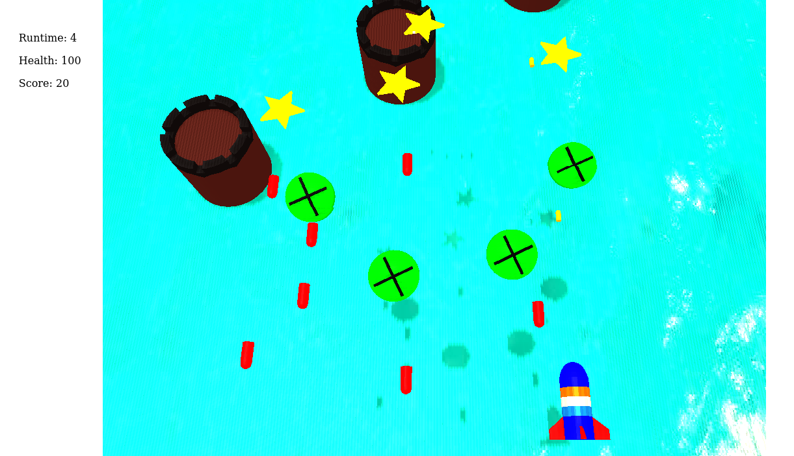

# GT Force

Game by Gaurang Tandon (2018101091) for Graphics Assignment 2

## Movie/Trailer

Link: [GT Force - the trailer](https://www.youtube.com/watch?v=g2Ayj9wmTng)

I made the full movie in Blender.

### Key features

1. Background music's beats rises in synchronization with the critical movie scenes
2. Rigid body physics simulations with the falling stars
3. Fire and smoke animation for the rocket jet exhaust (using winds and turbulence elements, followed a YT tutorial)
4. Camera tracking is not static, rather it dynamically moves around the aeroplane in all directions (up/bottom/front/back) to give an active sense of involvement in the scene
5. Used HDRI in the scene to give realistic background
6. Integrated all game models in the movie (player jet, enemy drone, both bullets, lighthouse, stars)

List of music used (in order):

1. Rainy night in Tallinn (Tenet)
2. 747 (Tenet)
3. Darude Sandstorm
4. BFG Division (Doom, 2016)

## Game

### To run

`python3 -m http.server 10046` starts an HTTP server on the current directory at `localhost:10046`. Navigate to `localhost:10046/src/html` to play the game. The instructions are on the start screen.

May need to do `npm i` in the current directory before running the game

### Key features

1. All game models are made by me in Blender on my own.
2. Slow motion feature of original game (wherein game slows down when not touching) is implemented
3. Enemies follow several group patterns (circles, ellipses, or straight lines)
4. Objects flying in the air cast shadow on the background
5. Code structure is modular, and also uses a resource tracker to dispose objects which are off-screen (Low Memory Usage program)
6. Game has endcard screen and startcard screen
7. Stars are collectible
8. Background has cool lighthouses to add to the environment
9. Rest all features as said in question PDF are there

